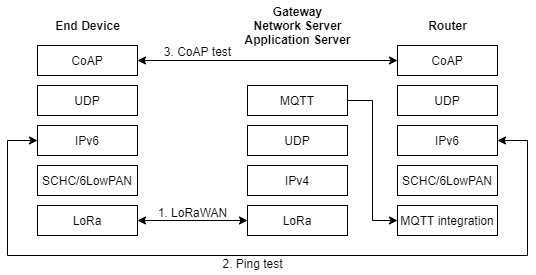

<h1 align="center">ipv6-lorawan</h1>

<b>[IPv6-over-LoRaWAN](https://github.com/aenrbes/IPv6-over-LoRaWAN) 레포의 설치 방법과 구성을 설명합니다.</b>

 

## 📋 Architecture

* 엔드 디바이스, 게이트웨이, 네트워크서버, 애플리케이션서버(네트워크 서버와 통합)를 구축하여 lorawan 환경 구축합니다.
* 애플리케이션 서버의 MQTT 프로토콜을 SCHC를 통해 IPv6 패킷으로 변환하게됩니다.
* 변환된 IPv6 패킷위에 UDP 및 CoAP를 올려 엔드 디바이스와 애플리케이션 서버 간에 CoAP 통신을 할 수 있게 됩니다. 

## 📜 Category

* 하기전에 봐야할 것
  * [필요한 장비들](./docs/prepare.md)
  * [라즈베리파이 ssh 접속과 spi 설정](./docs/raspberry.md)

1. lorawan 환경 구축하기(앤드 디바이스는 IPV6를 포함하기 때문에 밑에서 설명)
   * [게이트웨이](./docs/lorawan_gateway.md)
   * [네트워크서버 및 애플리케이션서버](./docs/lorawan_chirpstack.md)

2. [IPv6-over-LoRaWAN](https://github.com/aenrbes/IPv6-over-LoRaWAN) 레포의 howto 7번 ping command까지의 과정
   * [앤드디바이스](./docs/ipv6_endevice.md)
   * [border-router](./docs/ipv6_borderrouter.md)

3. [LoRaMac.c 분석](./docs/loramac_flowchart.md)
4. heltec 공식 사이트에 있는 예제 테스트하기
   * [LoRaWAN_151CC v1.0](./docs/LoRaWAN_151CC.md)
   * [LoRa_Node_151_LoRaWAN](./docs/LoRa_Node_151_LoRaWAN.md)

 
 

## 🖋 Author

👤 **박인효**

* Mail: [inhyopark122@gmail.com](mailto:inhyopark122@gmail.com)
* GitHub: [@PARKINHYO](https://github.com/PARKINHYO)

👤 **양현용**

* Mail: [9935ok9938gmail.com](mailto:9935ok9938gmail.com)
* GitHub: [@YangHyunYong](https://github.com/YangHyunYong)

 

## 📝 License

Copyright © 2021 [박인효](https://github.com/parkinhyo). 
This project is [MIT](https://github.com/LoRa-System/ipv6-lorawan/blob/master/LICENSE) licensed.
***
_This README was generated with ❤️ by [readme-md-generator](https://github.com/kefranabg/readme-md-generator)_
