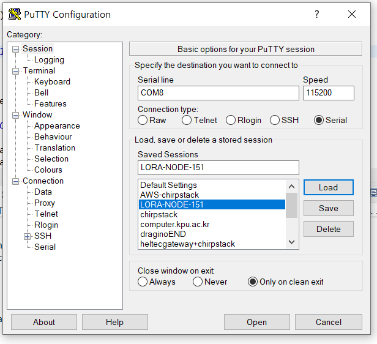
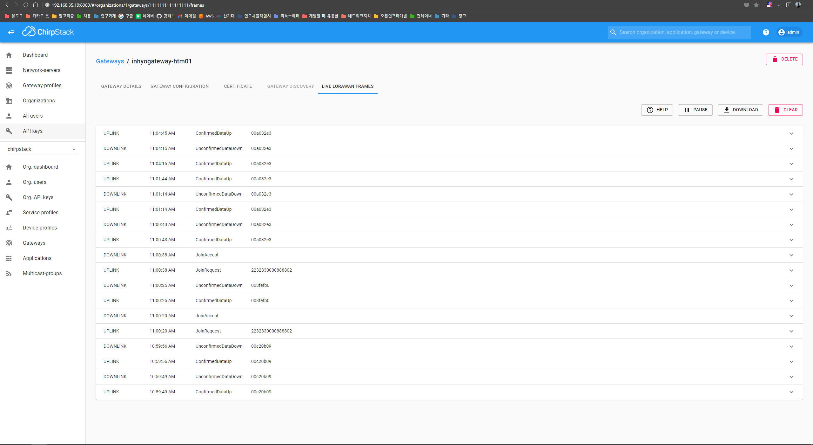

# LoRaWAN_151CC v1.0 예제 테스트

[heltec 사이트 참고](https://heltec-automation-docs.readthedocs.io/en/latest/stm32/lora_node_151/download_firmware.html)해서 예제 프로그램을 테스트합니다. 이미 프로그램들은 다 다운받아서 링크에 걸어놨습니다.

## 필요한 프로그램

[stm32cubeprogrammer](../assets/downloads/stm32cubeprogrammer.zip)
* firmware 업데이트할 때 사용. [참고](./ipv6_endevice.md)

[cubeide 다운](https://drive.google.com/file/d/17Eij9UC9eSBBQWbKmVsiL9ODc-DOLLgy/view?usp=sharing)
* 예제파일을 편집하고 flash 할 수 있는 툴

[예제 zip 파일](../assets/downloads/LoRaWAN_151CC_V1.0.zip)
* 예제 파일 소스코드

[stm32 st-link utility 프로그램 다운](../assets/downloads/stm32st-linkutility.zip)
* flash해서 엔드 디바이스에 들어간 코드들을 지울 때 사용하는 프로그램. [참고](./ipv6_endevice.md) 
* 지우개 버튼 누르면 flash로 내장된 프로그램이 지워진다.

<br><br>

## 테스트

### cubeide

cubeide를 키고 File → Open Project from File System...으로가서 예제 zip파일 압축 푼것을 프로젝트에 띄운다.


Inc 폴더의 Commissioning.h에서 LORAWAN_DEVICE_EUI, LORAWAN_APPLICATION_KEY만 애플리케이션 서버에 기입해주면된다. [참고](./ipv6_endevice.md)

위의 참고를 보고 stlink + 엔드디바이스로 컴퓨터에 엔드디바이스를 연결시킨뒤에 위에 그림의 2번 디버그 표시 버튼을 누르면 flash가 된다. 


flash를 하면서 디버깅을 위해서 엔드디바이스 안으로 들어가겠냐고(switch를 하겠냐고) 알림창이 2번 뜨는데 No를 해주면 된다.


Download verified sucessfully가 뜨면서 엔드디바이스에 코드가 flash 완료된다. 

<br><br>

### 게이트웨이, 네트워크&앱서버

게이트웨이, 네트워크&애플리케이션 서버를 켜준다. [참고(게이트웨이)](./lorawan_gateway.md),  [참고(네트워크&앱서버)](./lorawan_chirpstack.md)

<br><br>

### uart usb, putty

위에서 ide로 flash할 때 썼던 stlink usb를 뽑고, uart usb를 연결시킨다. 컴퓨터 + uart usb + 엔드디바이스 형태. [참고](./ipv6_endevice.md)



putty를 키고 위의 그림대로 COM포트랑 속도 115200으로 맞춘뒤에 터미널에 접속한다. 디바이스 버튼 누를 때 [참고](./ipv6_endevice.md).


lorawan(OTAA) 과정은 정상적으로 동작하지만 **앤드디바이스 터미널에서 출력이 안된다.**

**밑에 보면 왜 안됐었는지 코드를 분석해놓은 글이 있음.**

<br><br>

### lorawan 과정 완료 후 애플리케이션 서버 캡처 사진들

**gateway 패킷 전체 캡쳐, join request&accept, data up&down**




<br><br>

**application(enddevice) lorawan frames join request&accept, lorawan frames data up&down, device data**


<br><br>

## uart에서 프린트 안되는 현상 분석(v1.0)

**앤드디바이스 터미널에서 출력이 안되는 현상에 대한 분석(v1.0)**

**v1.0 예제** : LoRaWAN_151CC, 이 프로젝트로 오픈소스 만듬, 정상동작하지만 print가 안찍히는 예제

**v1.2 예제** : LoRa_Node_151_LoRaWAN, 정상 동작하고 print도 잘되지만 오픈소스에서 이 소스코드를 안씀

터미널에서 문자열을 출력하는 함수는 DebugPrintf()이고 정상 실행 시 가장 먼저 출력되는 문자열은 “Heltec lora node demo”이다. 해당 기능은 BoardInitMcu() 함수 내부에 존재하기 때문에 해당 함수 디버깅을 진행했다.

디버깅을 진행한 결과, putty에 정상적으로 출력되는 v.1.2는 DebugPrintf()가 Infinite_Loop에 빠지지 않고 여러 함수들을 거쳐 정상 동작하지만, 출력되지 않는 v.1.0은 Infinite_Loop에 빠져 아무 동작도 하지 않는 것을 확인했다. 아래 코드는 각각 v.1.0과 v.1.2의 DebugPrintf() 과정 중 Uart를 사용해 문자열을 출력할 때 호출되는 함수들이다. v.1.0은 FifoNext 이후 Push하는 과정이 없고 바로 Infinite_Loop이 호출되고 해당 코드에서 멈춰 있지만, v.1.2는 FifoNext 이후 FifoPush, BoardEnablelrq 등 추가적인 함수를 호출하고 문자열이 끝날 때까지 for문이 반복 실행된다. 반복 실행이 끝난 후 BoardInitMcu() 함수가 종료되고 다음 함수들이 호출되며 앤드디바이스가 정상 동작한다.  

**v1.0 예제 DebugPrintf 할 때 호출되는 내부의 함수들**

```
UartPutChar
UartMcuPutChar
IsFifoFull
FifoNext
Infinite_Loop
디버깅 과정중 여기서 아에 멈춰버림
```

**v1.2 예제 DebugPrintf 할 때 호출되는 내부의 함수들**

```
UartPutChar
UartMcuPutChar
BoardDisablelrq
IsFifoFull
FifoNext
FifoPush
FifoNext
BoardEnablelrq
...
...
for문으로 이러한 함수흐름 반복
```

<br><br>

위 문제에 대한 확실한 원인은 찾아내지 못했지만, 이후에 찾은 v.1.0과 v.1.2의 실행 과정 차이를 발견, 수정한 결과 해당 문제는 발생하지 않는다. 디버깅 결과, v.1.2는 src폴더 board.c의 BoardInitMcu() 함수의 `#elif defined( USE_DEBUGGER ) && !defined( USB_VCP )` 코드로 진입하지만 v.1.0은 해당 코드로 진입하지 못하는 것을 발견했다. elif 조건문으로 진입하는 조건에 대한 분석이 원활하지 않아 우선적으로 elif문을 없애고, `SystemClockConfig();` 코드 뒤에다가 없앴던 코드를 추가하여 조건문 없이 실행되도록 진행했다. 

**수정전**

```c
void BoardInitMcu( void )
{
  if( McuInitialized == false )
  {
#if defined( USE_BOOTLOADER )
    // Set the Vector Table base location at 0x3000
    SCB->VTOR = FLASH_BASE | 0x3000;
#endif
    HAL_Init( );
    
    SystemClockConfig( );
    
#if defined( USE_USB_CDC )
    UartInit( &UartUsb, UART_USB_CDC, NC, NC );
    UartConfig( &UartUsb, RX_TX, 115200, UART_8_BIT, UART_1_STOP_BIT, NO_PARITY, NO_FLOW_CTRL );
    DelayMs( 1000 ); // 1000 ms for Usb initialization

#elif defined( USE_DEBUGGER ) && !defined( USB_VCP )

    /*버전 1.2는 이쪽으로 진입 하는데 
    1.0은 이쪽으로 진입을 못해서 밑에서 DebugPrintf를 못함
    elif문을 없애서 무조건 밑의 코드가 실행될 수 있게 수정해줌*/

    FifoInit( &Uart1.FifoRx, UARTRxBuffer, FIFO_RX_SIZE );
    FifoInit( &Uart1.FifoTx, UARTTxBuffer, FIFO_TX_SIZE );
    Uart1.IrqNotify = loraMcuIrqNotify;
    UartInit( &Uart1, UART_1, UART_TX, UART_RX );
    UartConfig( &Uart1, RX_TX, 115200, UART_8_BIT, UART_1_STOP_BIT, NO_PARITY, NO_FLOW_CTRL );
#elif defined( USE_DEBUGGER ) && defined( USB_VCP )
	USB_VCP_init();
//	HAL_Delay( 3000 ); //wait for usb init
	DebugPrintf("USB CDC init done!\r\n");
#endif

    // 이게 찍혀야되는데 찍히지 않았음
    DebugPrintf("Heltec lora node demo\r\n");

    RtcInit( );
```

**수정후**

```c
void BoardInitMcu( void )
{
  if( McuInitialized == false )
  {
#if defined( USE_BOOTLOADER )
    // Set the Vector Table base location at 0x3000
    SCB->VTOR = FLASH_BASE | 0x3000;
#endif
    HAL_Init( );
    
    SystemClockConfig( );


    /*elif를 없애고 이쪽에 넣어서 무조건 실행되게 해주었음*/
    FifoInit( &Uart1.FifoRx, UARTRxBuffer, FIFO_RX_SIZE );
    FifoInit( &Uart1.FifoTx, UARTTxBuffer, FIFO_TX_SIZE );
    Uart1.IrqNotify = loraMcuIrqNotify;
    UartInit( &Uart1, UART_1, UART_TX, UART_RX );
    UartConfig( &Uart1, RX_TX, 115200, UART_8_BIT, UART_1_STOP_BIT, NO_PARITY, NO_FLOW_CTRL );
    
#if defined( USE_USB_CDC )
    UartInit( &UartUsb, UART_USB_CDC, NC, NC );
    UartConfig( &UartUsb, RX_TX, 115200, UART_8_BIT, UART_1_STOP_BIT, NO_PARITY, NO_FLOW_CTRL );
    DelayMs( 1000 ); // 1000 ms for Usb initialization
#elif defined( USE_DEBUGGER ) && defined( USB_VCP )
   USB_VCP_init();
//   HAL_Delay( 3000 ); //wait for usb init
   DebugPrintf("USB CDC init done!\r\n");
#endif
    DebugPrintf("Heltec lora node demo\r\n");
    RtcInit( );

```

앤드디바이스에 코드를 수정한 v.1.0을 주입한 결과, 문자열이 출력되지 않던 putty창에 “Heltec lora node demo” 문자열의 일부가 출력되는 것을 아래 사진을 통해 확인할 수 있다. 또한 출력되지 않는 상태에서의 BoardInitMcu() 내부 함수 호출과정이 기존 v.1.0과 달리 v.1.2와 동일하게 흘러가는 것을 확인하였다. 이를 통해 Infinite_Loop에 빠지는 문제는 Uart의 Init과 Config가 정상적으로 진행되지 않았기 때문에 발생하는 것이라고 판단된다.


그러나 전체 문자열이 출력되지 않고 일부만 출력되고 패킷이 깨지면서 이후에 실행되어야 하는 기능들은 정상적으로 실행되지 않는 문제가 존재한다. 해당 문제는 BoardInitMcu() 함수 내에 Uart 관련 함수 앞에 있는 HAL_Init()과 SystemClockConfig() 함수에 원인이 있다고 판단하고 해당 함수들을 분석할 계획이다.

```c
void BoardInitMcu( void )
{
  if( McuInitialized == false )
  {
#if defined( USE_BOOTLOADER )
    // Set the Vector Table base location at 0x3000
    SCB->VTOR = FLASH_BASE | 0x3000;
#endif

    /*DebugPrintf 관련 함수들 앞에 있기 때문에 HAL_Init, 
    SystemClockConfig 함수 분석 예정*/
    HAL_Init( );
    SystemClockConfig( );

    FifoInit( &Uart1.FifoRx, UARTRxBuffer, FIFO_RX_SIZE );
    FifoInit( &Uart1.FifoTx, UARTTxBuffer, FIFO_TX_SIZE );
    Uart1.IrqNotify = loraMcuIrqNotify;
    UartInit( &Uart1, UART_1, UART_TX, UART_RX );
    UartConfig( &Uart1, RX_TX, 115200, UART_8_BIT, UART_1_STOP_BIT, NO_PARITY, NO_FLOW_CTRL );
    ...
    ...
```