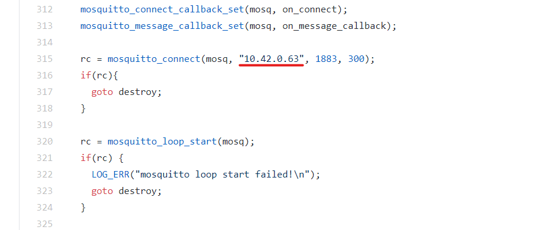
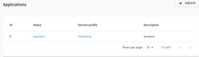
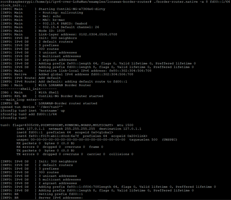

## border-router 설치

[IPv6-over-LoRaWAN](https://github.com/aenrbes/IPv6-over-LoRaWAN)레포 howto 4번 border-router를 설치한다. 

```bash
git clone https://github.com/aenrbes/ipv6-over-LoRaWan.git
sudo apt-get install libmosquitto-dev\
```

```bash
# nano /home/pi/ipv6-over-LoRaWan/os/services/lorawan-border-router/native/slip-trx.c
# 거의 맨 아래 부분에 있음 

 rc = mosquitto_connect(mosq, "10.42.0.63", 1883, 300);
  if(rc){
    goto destroy;
  }
```



ip를 네트워크 서버의 로컬 주소로 수정. border-router, 네트워크&앱서버를 한곳에 설치하기 때문에 현재 로컬 ip 주소를 적어주면된다. 

이제 border-router를 설치하자. 

```bash
git clone https://github.com/aenrbes/ipv6-over-LoRaWan.git
cd examples/lorawan-border-router
make
sudo ./border-router -a 1 fd00::1/64
(the "-a" option correspond the appID in chirpstack)
```



-a의 인자는 App server에 등록된 application id의 인덱스를 넣어준다. 위 사진에서는 8 이니깐 `sudo ./border-router.native -a 8 fd00::1/64` 이런식으로 해야한다. 앱서버를 확인한 뒤 자신에 맞는 인자로 명령을 실행한다. 



bash 창에서 enter를 치면 명령어를 입력할 수 있다. [동영상 참고](https://www.bilibili.com/video/BV1ih411o7Uz)