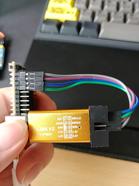
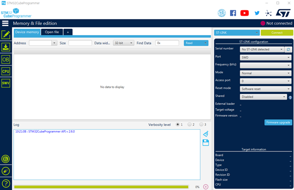
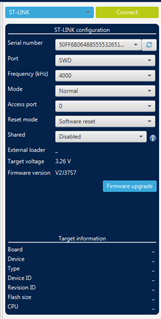
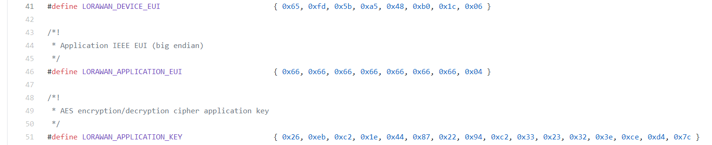
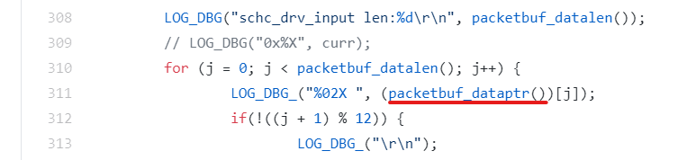
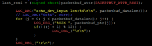
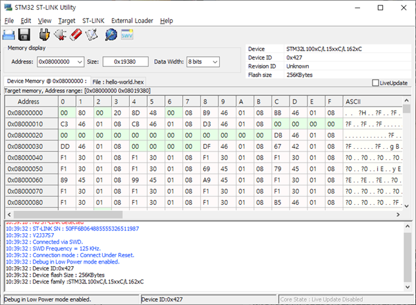
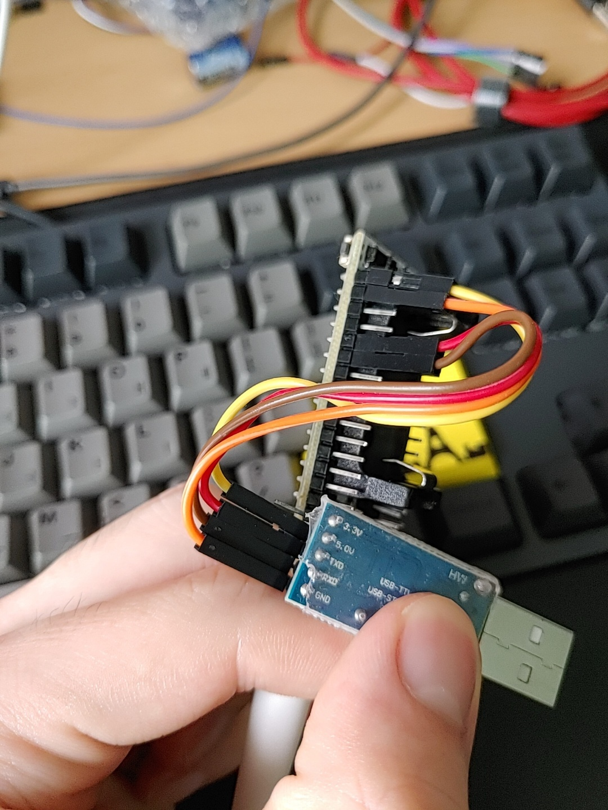
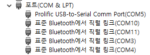
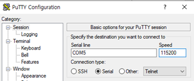

# 엔드 디바이스 구축 과정

[장비 lora-node-151](https://heltec.org/project/lora-node-151/)

[heltec 공식 문서](https://heltec-automation-docs.readthedocs.io/en/latest/stm32/lora_node_151/index.html)

1. 기본적인 장비의 펌웨어를 업데이트
2. [ipv6-over-lorawan](https://github.com/aenrbes/IPv6-over-LoRaWAN) 엔드 디바이스쪽 코드 수정과 컴파일로 hello-world.hex 파일 생성
3. 엔드디바이스에 hex파일 넣고 실행하기

## 펌웨어 업데이트

윈도우에서 진행. 

[stm32cubeprogrammer 프로그램 설치](../assets/downloads/stm32cubeprogrammer.zip)

[loranode151 pin diagram](https://resource.heltec.cn/download/LoRa_Node_151/LoRa_Node_151_Pinout_Diagram.pdf)

[stlink v2](https://smartstore.naver.com/makerspace/products/4624374784?NaPm=ct%3Dkqai6jq0%7Cci%3D493b4e60bcf3be5c743d6d3c21de02e270283501%7Ctr%3Dsls%7Csn%3D525290%7Chk%3Db3f4ed18121d6eb568c894fe9c39d89915ddd06e)



User 라인쪽 차례로 vdd, gnd swclk, swdio를 stlink에 일치하게끔 4개의 핀을 연결한다. vdd는 3.3v.



stm32cubeprogrammer프로그램을 킨 상태에서 엔드 디바이스를 보면 밑의 양쪽에 user, rst버튼이 있다. 이 두개의 버튼을 누른 상태에서 컴퓨터 usb에 꼿고 프로그램의 오른쪽에 connect나 refresh 클릭하고(계속 user, rst버튼 누른상태) user, rst 버튼 누르고 있는걸 때면 연결된다. 밑은 연결된 사진.



밑에 펌웨어 업데이트를 클릭하고 open in update mode를 클릭하고, 그 밑의 upgrade를 클릭하면 firmware 업데이트가 완료된다. 

## ipv6-over-lorawan 레포에서 엔드 디바이스용 hex파일 만들기

raspberry ubuntu 에서 진행

[ipv6-over-lorawan](https://github.com/aenrbes/IPv6-over-LoRaWAN) 파일을 git clone 한다. 

```bash
git clone https://github.com/aenrbes/IPv6-over-LoRaWAN.git
```

네트워크 서버와 otaa 과정을 위해 관련된 key 값을 수정해야 한다. /home/pi/ipv6-over-LoRaWan/arch/cpu/loramac/mac/Inc/Commissioning.h 파일과 네트워크서버의 설정과 일치해야 한다. 



chirpstack 네트워크 서버에서 엔드디바이스의 정보를 넣는칸에 LORAWAN_DEVICE_EUI, LORAWAN_APPLICATION_KEY만 있다. 이 두가지만 네트워크 서버랑 맞춰주기만 하면 동작한다. 

LORAWAN_APPLICATION_EUI만 전부 0x00, 0x00, 0x00, ... 모두 0으로 바꾸고 나머지는 그대로 유지한다. LORAWAN_DEVICE_EUI, LORAWAN_APPLICATION_KEY는 네트워크 서버에 맞춰줄것이다. [네트워크 서버 설정하기](./lorawan_chirpstack.md)

hello-world.hex를 만들기위해 컴파일하자. 

```bash
cd examples/hello-world
sudo apt-get install gcc-arm-none-eabi
```

```bash
nano ../../os/net/ipv6/schc/schc.c
```



Ctrl+w(검색기능) 후 packetbuf_dataptr를 입력하고 enter를 쳐서 위의 사진에 보여지는 부분으로 이동 후 아래 사진처럼 packetbuf_ptr로 변경, Ctrl+x -> y -> enter 로 파일 저장.



이런식으로 변경

```bash
# make 
make TARGET=loramac
```

/home/pi/ipv6-over-LoRaWan/examples/hello-world/build/loramac 폴더에 있는 hello-world.hex 파일을 filezila 프로그램(windows에서 따로 설치)을 사용하여 windows 환경으로 가져온다. 이제 윈도우로 가져왔으면 이걸 가지고 윈도우 환경에서 stm32 utility 프로그램을 사용해서 hex 파일을 앤드 디바이스에 넣을것이다. 

## stm32 utility 프로그램을 사용해서 hex파일 엔드디바이스에 넣기

윈도우 환경에서 진행

[stm32 st-link utility 프로그램 다운](../assets/downloads/stm32st-linkutility.zip)

설치되면 프로그램을 키고 ST-LINK 연결 후(위쪽에 핀 매핑 있음) 왼쪽 상단의 콘센트 모양의 버튼 클릭을 통해 연결 성공 확인. 



Target -> program & verify 선택 후 위에서 만든 hello-world.hex 파일을 넣고 flash 진행

## stlinkv2 usb가 아닌 uart usb를 통해 엔드 디바이스 실행

윈도우 환경에서 진행

[uart usb](http://www.mechasolution.com/shop/goods/goods_view.php?inflow=naverCheckout&goodsno=539777&NaPm=ct%3Dkqal7hxs%7Cci%3Dcheckout%7Ctr%3Dppc%7Ctrx%3D%7Chk%3Da3969765b3c1b6025f22ac204dac03d0cb4f81a4)

[loranode151 pin diagram](https://resource.heltec.cn/download/LoRa_Node_151/LoRa_Node_151_Pinout_Diagram.pdf)




lora node 151에서 vdd, gnd, rx1, tx1를 순서대로 uart의 3v, gnd, txd, rxd에 연결한다. 여기서 rx tx를 둘이 서로 반대로 연결해야 한다. 그래야지 통신을 할 수 있다. 



노트북과 lora-node-151을 UART를 통해 연결하면 장치관리자에서 COM 포트가 추가된다. putty의 Serial을 선택한 후 해당 포트의 번호를 Serial line에 입력하고 Speed를 115200으로 설정한 후 실행시킨다.



Putty 창이 켜진 상태에서 lora-node-151의 reset(RST) 버튼을 꾹 눌렀다가 떼면 flash 된 파일이 실행된다.