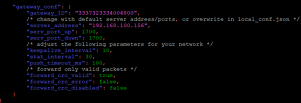

# heltec ht-m01 게이트웨이 라즈베리파이에 연결하기

[ht-m01](https://heltec.org/project/ht-m01/)

[공식문서](https://heltec-automation-docs.readthedocs.io/en/latest/gateway/ht-m01/quick_start.html#use-ht-m01-with-linux-raspberry-pi)

USB 케이블로 raspberry pi와 gateway 연결한다. 이 떄 케이블의 질이 좋아야 한다. 안그러면 연결이 잘 안되는 경우가 있었다. 

ht-m01 전용 packet-forwarder를 설치하자. packet-forwarder 프로그램은 엔드 디바이스로부터 온 로라 패킷을 udp로 네트워크 서버쪽의 브리지로 보낸다. 

```bash
mkdir lora
cd lora
sudo apt-get update
sudo apt-get install git
git clone https://github.com/Lora-net/lora_gateway.git
# LoRa Gateway drivers
git clone https://github.com/Lora-net/packet_forwarder.git
# packet forwarding software
git clone https://github.com/HelTecAutomation/lorasdk.git
# This package will create a "lrgateway" service in Raspberry Pi
cd /home/pi/lora/lora_gateway
make clean all
cd /home/pi/lora/packet_forwarder
make clean all
cd /home/pi/lora/lorasdk
chmod +x install.sh 
./install.sh
#Run the script. After the script is run, it will create a service named "lrgateway". The purpose is to make the lora driver and data forwarding program run automatically at startup.
sudo cp -f /home/pi/lora/lorasdk/global_conf_EU868.json /home/pi/lora/packet_forwarder/lora_pkt_fwd/global_conf.json
#the "global_conf_EU868.json" may need change to your need.
```

```bash
nano /home/pi/lora/picoGW_packet_forwarder/lora_pkt_fwd/global_conf.json
```



위의 파일로 이동해서 맨 밑에 gateway_conf 안쪽의 gateway_ID 16자리의 key가 chirpstack네트워크 서버랑 일치해야한다. 저 key를 네트워크 서버 gateway 쪽에 써주면 된다. 

server_address를 자신의 ip 주소를 기입해주고(gateway, networkserver가 같은 라즈베리파이임), serv_port_up, serv_port_down을 1700으로 해준다. 

```bash
# 한번 재실행 해준다.
sudo systemctl restart lrgateway

# 상태가 정상인지 체크한다. 
sudo sysetmctl status lrgateway
```

HT-M01의 발열이 심하기 때문에 중간중간 systemctl stop lorgateway 후 start하는 방식으로 진행하는게 좋다. 

